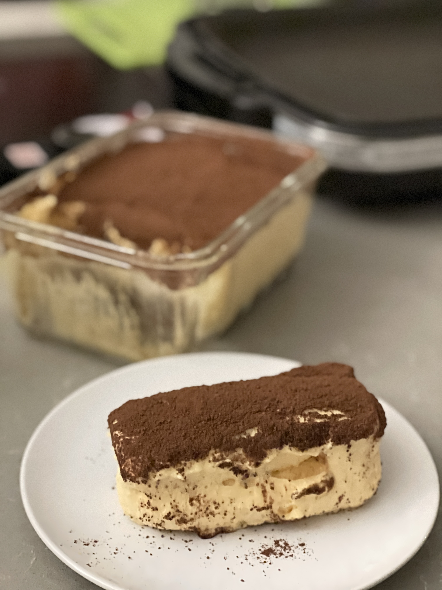

# 提拉米苏的做法

<a href="https://zh.wikipedia.org/wiki/提拉米苏">提拉米苏</a>，是意大利传统甜品。无需烤箱操作简便，烘焙新手也可以零失误获得一份美味的<a href="https://zh.wikipedia.org/wiki/提拉米苏">提拉米苏</a>。

## 必备原料和工具

- 马斯卡彭<a href="https://zh.wikipedia.org/wiki/芝士">芝士</a>
- 手指饼干
- 放凉<a href="https://zh.wikipedia.org/wiki/浓缩咖啡">浓缩咖啡</a>
- 无菌鸡蛋
- <a href="https://zh.wikipedia.org/wiki/白砂糖">白砂糖</a>
- <a href="https://zh.wikipedia.org/wiki/可可粉">可可粉</a>
- <a href="https://zh.wikipedia.org/wiki/朗姆酒">朗姆酒</a>（不喜欢酒的朋友可省略，可按照自己口味调节）
- 一个装成品的容器（这里用的是玻璃乐扣）
- 打蛋器（手劲儿大的朋友也可以锻炼臂力）

## 计算

- 马斯卡彭<a href="https://zh.wikipedia.org/wiki/芝士">芝士</a> 450g
- 手指饼干 1 包
- 放凉<a href="https://zh.wikipedia.org/wiki/浓缩咖啡">浓缩咖啡</a> 350ml
- 无菌鸡蛋 4 个
- <a href="https://zh.wikipedia.org/wiki/白砂糖">白砂糖</a> 50g
- <a href="https://zh.wikipedia.org/wiki/可可粉">可可粉</a> 10g
- <a href="https://zh.wikipedia.org/wiki/朗姆酒">朗姆酒</a> 35ml

## 操作

- 分离蛋黄蛋清
- 盛有蛋白的碗中加 10g <a href="https://zh.wikipedia.org/wiki/白砂糖">白砂糖</a>湿性打发
- 盛有蛋黄的碗中将 40g <a href="https://zh.wikipedia.org/wiki/白砂糖">白砂糖</a>分三次加入，搅拌至均匀
- 蛋黄中分三次加入马斯卡彭<a href="https://zh.wikipedia.org/wiki/芝士">芝士</a>，搅拌至均匀
- 蛋黄中最后加入<a href="https://zh.wikipedia.org/wiki/朗姆酒">朗姆酒</a>，搅拌均匀
- 将打发好的蛋白分三次加入蛋黄<a href="https://zh.wikipedia.org/wiki/芝士">芝士</a>液中
- 手指饼干两面浸湿咖啡液，平铺入容器
- 两层<a href="https://zh.wikipedia.org/wiki/芝士">芝士</a>液两层饼干交替放入容器（这一步按照大家意愿及容器高度酌情处理）
- 放入冰箱冷藏四个小时（心急的小伙伴可以提早拿出来）
- 取出后在表面筛上<a href="https://zh.wikipedia.org/wiki/可可粉">可可粉</a>，即可享用啦

## 附加内容

- [下厨房蛋白打发具体教程](https://www.xiachufang.com/recipe/101779500/)

